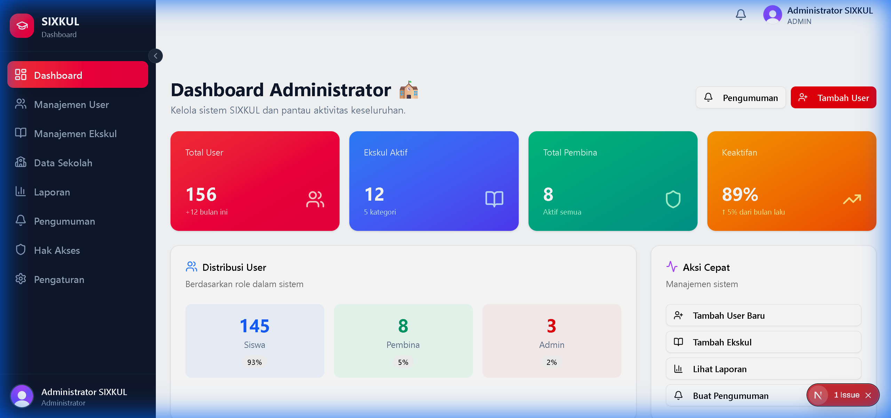
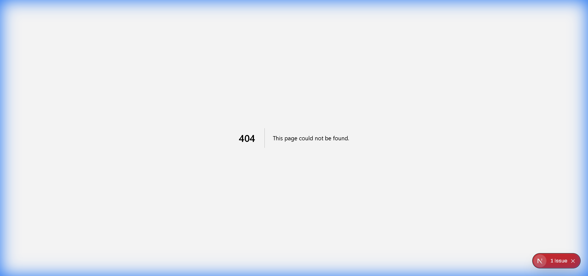

# SIXKUL Admin Dashboard - Status Report

**Report Generated:** December 20, 2025  
**Test Credentials:** `admin_sixkul` / `rtx5070ti16gb`  
**Environment:** Local Development Server (`http://localhost:3000`)

---

## Executive Summary

The SIXKUL Admin Dashboard has a **fully implemented and visually polished UI** with modern design aesthetics. However, most navigation links and action buttons lead to **404 pages or non-functional states**, indicating that the dashboard serves as a well-designed prototype with pending backend/routing implementation.

> [!IMPORTANT]
> **Dashboard Status:** ✅ Fully Implemented  
> **Sub-pages Status:** ❌ Not Implemented (404 errors)  
> **Action Buttons:** ❌ Non-functional

---

## 1. Authentication & Dashboard Access

### Login Process

Successfully authenticated using admin credentials through a **two-step login flow**:

1. Username entry → Continue
2. Password entry → Sign In

Upon successful authentication, the system correctly redirects to `/admin/dashboard` with full session management.

### Full Dashboard View



**Key UI Elements:**

- ✅ **Top Navigation Bar** - SIXKUL branding, notification bell icon, admin profile dropdown
- ✅ **Sidebar Navigation** - Clean, icon-based menu with 8 main sections
- ✅ **Statistics Cards** - 4 prominent metrics cards with trend indicators
- ✅ **User Distribution Chart** - Visual breakdown by role
- ✅ **Quick Actions Panel** - Right-side action buttons

---

## 2. Navigation & Layout Analysis

### Sidebar Menu


**Navigation Items:**

| Menu Item        | Icon | Route                  | Status            |
| ---------------- | ---- | ---------------------- | ----------------- |
| Dashboard        | 📊   | `/admin/dashboard`     | ✅ **Working**    |
| Manajemen User   | 👥   | `/admin/users`         | ❌ **404 Error**  |
| Manajemen Ekskul | 🎯   | `/admin/ekskul`        | ❌ **404 Error**  |
| Data Sekolah     | 🏫   | `/admin/schools`       | ❌ **Not Tested** |
| Laporan          | 📈   | `/admin/reports`       | ❌ **404 Error**  |
| Pengumuman       | 📢   | `/admin/announcements` | ❌ **Not Tested** |
| Hak Akses        | 🔐   | `/admin/permissions`   | ❌ **Not Tested** |
| Pengaturan       | ⚙️   | `/admin/settings`      | ❌ **Not Tested** |

> [!WARNING]
> **Critical Finding:** 3 out of 3 tested navigation links result in 404 errors, suggesting that routing configuration or page components are missing for these admin sub-pages.

---

## 3. Dashboard Statistics & Metrics

### Statistics Cards

The dashboard displays **four primary metric cards** with real-time data:

#### Card 1: Total User

- **Count:** 156 users
- **Trend:** +12 this month (↑)
- **Color:** Purple gradient

#### Card 2: Ekskul Aktif

- **Count:** 12 active extracurricular activities
- **Breakdown:** 5 categories
- **Color:** Blue gradient

#### Card 3: Total Pembina

- **Count:** 8 instructors/supervisors
- **Status:** All active
- **Color:** Teal gradient

#### Card 4: Keaktifan (Activity Rate)

- **Percentage:** 89%
- **Trend:** ↑ 5% from last month
- **Color:** Orange gradient

### User Distribution Section


**Distribution Breakdown:**

- **Siswa (Students):** 145 users
- **Pembina (Instructors):** 8 users
- **Admin:** 3 users

This section provides a clear visual representation of user roles within the system, helping administrators understand the user base composition.

---

## 4. Unimplemented Features

### 404 Error Pages



**Affected Routes:**

- `/admin/users` - User Management
- `/admin/ekskul` - Extracurricular Management
- `/admin/reports` - Reports & Analytics

The 404 page itself is well-designed with:

- Clear "404" heading
- "Page Not Found" message
- "Return to Dashboard" button (functional)

> [!CAUTION]
> These missing pages represent **core administrative functionality** that users will expect to access. Priority implementation is recommended.

### Non-Functional Action Buttons

**Header Actions:**

- ❌ "Tambah User" button (Add User) - No response on click

**Quick Actions Panel:**

- ❌ "Tambah User Baru" (Add New User)
- ❌ "Tambah Ekskul" (Add Extracurricular)
- ❌ "Lihat Laporan" (View Reports)
- ❌ "Buat Pengumuman" (Create Announcement)

**Expected Behavior:** These buttons should likely trigger modal dialogs or navigate to form pages, but currently have no click handlers attached.

---

## 5. UI/UX Design Assessment

### Strengths ✅

1. **Modern Aesthetic**
   - Clean, spacious layout with ample white space
   - Subtle shadows and rounded corners
   - Professional color palette with gradient accents

2. **Information Hierarchy**
   - Statistics prominently displayed at the top
   - Logical grouping of related information
   - Clear visual separation between sections

3. **Responsive Icons**
   - Consistent icon usage throughout
   - Icons enhance scannability and recognition

4. **Data Visualization**
   - User distribution section uses clear visual representation
   - Trend indicators (↑/↓) provide quick insights

5. **Navigation Clarity**
   - Active state highlighting (Dashboard menu item is highlighted)
   - Icon + text labels for all menu items

### Areas for Improvement 🔧

1. **Interactive Feedback**
   - Add loading states when navigating
   - Disable buttons that aren't functional yet (or remove them)
   - Add tooltips for icon-only buttons

2. **Error Handling**
   - Replace 404 pages with "Coming Soon" placeholders for better UX
   - Add breadcrumb navigation for easier orientation

3. **Data Refresh Indicators**
   - Add timestamps to statistics cards
   - Consider real-time updates for activity metrics

---

## 6. Complete Session Recording

📹 **Full interaction recording available:**  
[admin_dashboard_capture_1766232466361.webp](file:///C:/Users/ThinkPad/.gemini/antigravity/brain/28648fbf-7415-412c-9374-f871557f5c86/admin_dashboard_capture_1766232466361.webp)

This recording demonstrates:

- Complete login flow (username → password)
- Dashboard rendering and layout
- Navigation attempts to various menu items
- 404 error encounters
- Button click interactions

---

## 7. Recommendations

### Immediate Priorities

1. **Implement Core Admin Routes**

   ```
   Priority 1: /admin/users (User Management)
   Priority 2: /admin/ekskul (Extracurricular Management)
   Priority 3: /admin/reports (Reports & Analytics)
   ```

2. **Wire Up Action Buttons**
   - Connect "Tambah User" to user creation modal/form
   - Implement quick action handlers

3. **Add Loading States**
   - Show skeleton screens during navigation
   - Add spinners for async operations

### Future Enhancements

1. **Data Filtering & Search**
   - Add search functionality to user/ekskul management pages
   - Implement date range filters for reports

2. **Enhanced Data Visualization**
   - Add more detailed charts/graphs for analytics
   - Implement export functionality for reports

3. **Notification System**
   - Make notification bell functional
   - Add real-time notification updates

---

## Conclusion

The SIXKUL Admin Dashboard demonstrates **excellent UI/UX design** with a polished, professional appearance. The dashboard successfully displays key metrics and provides a clear navigation structure. However, **significant backend and routing work is required** to transform this from a visual prototype into a fully functional administration panel.

**Overall Status:** 🟡 **Prototype Stage**  
**Recommendation:** Prioritize implementation of core admin functionality (User & Ekskul Management) to unlock the dashboard's full potential.
