# 🔐 ADMIN Role Implementation Status Report

**Project**: SIXKUL - Sistem Informasi Ekstrakurikuler  
**Report Date**: December 20, 2025  
**Report Type**: Comprehensive Technical Implementation Status  
**Target Role**: ADMIN (Administrator)

---

## 📋 Executive Summary

This report provides a **full, complete, comprehensive, thorough, absolute, ultimate, detailed, and technical-level** implementation status of all ADMIN role-related pages, functionalities, use cases, features, and application flow in the SIXKUL codebase.

> [!IMPORTANT]
> **Current Implementation Status**: The ADMIN role has **PARTIAL IMPLEMENTATION** with foundational infrastructure complete (authentication, routing, layout, dashboard UI) and two functional API endpoints (user management and extracurricular management). However, **MOST NAVIGATION PAGES ARE NOT YET IMPLEMENTED** - only 1 out of 8 menu items has a working page.

---

## 🏗️ Architecture Overview

### Technology Stack

| Component | Technology | Version |
|-----------|-----------|---------|
| Framework | Next.js (App Router) | 16.x |
| Language | TypeScript | Latest |
| Database | PostgreSQL | 14.x+ |
| ORM | Prisma | 6.x |
| Authentication | Clerk | Latest |
| UI Components | ShadCN UI + Radix UI | Latest |
| Styling | Tailwind CSS | 4.x |

### Database Schema - ADMIN Role

The ADMIN role in the Prisma schema is defined as an enum value:

```prisma
enum UserRole {
  ADMIN
  PEMBINA
  SISWA
}
```

**User Model** (Relevant Fields):
```prisma
model User {
  id            String   @id @default(cuid())
  clerk_id      String   @unique
  username      String   @unique
  email         String?
  full_name     String
  role          UserRole  // ADMIN role stored here
  avatar_url    String?
  created_at    DateTime @default(now())
  updated_at    DateTime @updatedAt
  
  notifications  Notification[]
  announcements  Announcement[]
}
```

> [!NOTE]
> Unlike `SISWA` (StudentProfile) and `PEMBINA` (PembinaProfile), the ADMIN role **does NOT have a dedicated profile model**. Admin users only exist in the [User](file:///d:/university_life/Semester_5/sistem_informasi_manajemen/projects/sixkul-sim-nextjs16-approuter/src/app/api/admin/users/route.ts#61-85) table.

---

## 🔒 Authentication & Authorization

### Middleware Protection

**File**: [src/proxy.ts](file:///d:/university_life/Semester_5/sistem_informasi_manajemen/projects/sixkul-sim-nextjs16-approuter/src/proxy.ts)

The middleware implements comprehensive role-based access control using Clerk:

#### Route Matchers

```typescript
// Define role-specific routes
const isAdminRoute = createRouteMatcher(["/admin(.*)"]);
```

#### Authentication Flow

1. **Unauthenticated Access to `/` or `/sign-in`**: Redirect to `/sign-in`
2. **Authenticated Access to `/`**: Redirect to role-specific dashboard
   - ADMIN → `/admin/dashboard`
   - PEMBINA → `/pembina/dashboard`
   - SISWA → `/student/dashboard`
3. **Protected Route Access**: Verify authentication + role match

#### Role Verification Logic

```typescript
// Extract role from Clerk session claims
const userRole = (sessionClaims?.public_metadata as { role?: string })?.role;

// ADMIN route protection
if (isAdminRoute(req) && userRole !== "ADMIN") {
  return NextResponse.redirect(new URL("/unauthorized", req.url));
}
```

> [!CAUTION]
> **Security**: Role verification relies on `public_metadata.role` set in Clerk Dashboard. Ensure this metadata is properly configured for all admin users.

### Authentication in API Routes

All ADMIN API routes implement the [authenticateAdmin()](file:///d:/university_life/Semester_5/sistem_informasi_manajemen/projects/sixkul-sim-nextjs16-approuter/src/app/api/admin/users/route.ts#96-140) helper function:

**File**: [src/app/api/admin/users/route.ts](file:///d:/university_life/Semester_5/sistem_informasi_manajemen/projects/sixkul-sim-nextjs16-approuter/src/app/api/admin/users/route.ts#L99-L139)

```typescript
async function authenticateAdmin(): Promise<{
  success: boolean;
  userId?: string;
  error?: string;
  statusCode?: number;
}> {
  const { userId, sessionClaims } = await auth();
  
  if (!userId) {
    return {
      success: false,
      error: "Authentication required. Please login.",
      statusCode: 401,
    };
  }
  
  const userRole = (sessionClaims?.public_metadata as { role?: string })?.role;
  
  if (userRole !== "ADMIN") {
    return {
      success: false,
      error: "Admin access required.",
      statusCode: 403,
    };
  }
  
  return { success: true, userId };
}
```

**Security Features**:
- JWT session validation via Clerk
- Role-based authorization (403 Forbidden for non-ADMIN)
- Authentication requirement (401 Unauthorized for unauthenticated)

---

## 🎨 Layout & Navigation

### Admin Layout Component

**File**: [src/app/(dashboard)/admin/layout.tsx](file:///d:/university_life/Semester_5/sistem_informasi_manajemen/projects/sixkul-sim-nextjs16-approuter/src/app/(dashboard)/admin/layout.tsx)

**Component Type**: Client Component (`use client`)

#### Features

1. **Clerk Integration**: Uses `useUser()` hook for authentication state
2. **JIT User Sync**: Implements `useAuthSync()` to sync Clerk users to Prisma database
3. **Loading State**: Displays spinner while authenticating or syncing
4. **Shared Layout Components**:
   - `<Sidebar>` - Left navigation panel
   - `<TopNavbar>` - Top navigation bar with user profile

#### Layout Structure

```tsx
<div className="min-h-screen bg-slate-50 dark:bg-slate-950">
  {/* Sidebar - Fixed left */}
  <Sidebar menuItems={adminMenuItems} user={userData} />
  
  {/* Main Content Area */}
  <div className="md:ml-64 transition-all duration-300">
    {/* Top Navigation */}
    <TopNavbar user={userData} />
    
    {/* Page Content */}
    <main className="pt-20 px-4 md:px-6 pb-8">
      <div className="max-w-7xl mx-auto">{children}</div>
    </main>
  </div>
</div>
```

### Navigation Menu Configuration

The ADMIN navigation menu contains **8 items**:

| # | Label | Route | Icon | Status |
|---|-------|-------|------|--------|
| 1 | Dashboard | `/admin/dashboard` | LayoutDashboard | ✅ Implemented |
| 2 | Manajemen User | `/admin/users` | Users | ❌ Not Implemented |
| 3 | Manajemen Ekskul | `/admin/ekskul` | BookOpen | ❌ Not Implemented |
| 4 | Data Sekolah | `/admin/school` | School | ❌ Not Implemented |
| 5 | Laporan | `/admin/reports` | BarChart3 | ❌ Not Implemented |
| 6 | Pengumuman | `/admin/announcements` | Bell | ❌ Not Implemented |
| 7 | Hak Akses | `/admin/permissions` | Shield | ❌ Not Implemented |
| 8 | Pengaturan | `/admin/settings` | Settings | ❌ Not Implemented |

**Navigation Menu Code**:
```typescript
const adminMenuItems: NavItem[] = [
  { label: "Dashboard", href: "/admin/dashboard", icon: LayoutDashboard },
  { label: "Manajemen User", href: "/admin/users", icon: Users },
  { label: "Manajemen Ekskul", href: "/admin/ekskul", icon: BookOpen },
  { label: "Data Sekolah", href: "/admin/school", icon: School },
  { label: "Laporan", href: "/admin/reports", icon: BarChart3 },
  { label: "Pengumuman", href: "/admin/announcements", icon: Bell },
  { label: "Hak Akses", href: "/admin/permissions", icon: Shield },
  { label: "Pengaturan", href: "/admin/settings", icon: Settings },
];
```

---

## 📄 Pages & Routes

### 1. Dashboard (`/admin/dashboard`)

**File**: [src/app/(dashboard)/admin/dashboard/page.tsx](file:///d:/university_life/Semester_5/sistem_informasi_manajemen/projects/sixkul-sim-nextjs16-approuter/src/app/(dashboard)/admin/dashboard/page.tsx)

**Status**: ✅ **FULLY IMPLEMENTED** (UI Only - Mock Data)

**Component Type**: Server Component (default)

#### Features

##### A. Header Section
- Welcome message: "Dashboard Administrator 🏫"
- Subtitle: "Kelola sistem SIXKUL dan pantau aktivitas keseluruhan."
- Action buttons:
  - "Pengumuman" (Outline button with Bell icon)
  - "Tambah User" (Primary button with UserPlus icon)

##### B. Statistics Cards (4 Cards with Gradient Backgrounds)

| Card | Value | Description | Color Scheme |
|------|-------|-------------|--------------|
| Total User | 156 | +12 bulan ini | Red gradient (from-red-500 to-rose-600) |
| Ekskul Aktif | 12 | 5 kategori | Blue gradient (from-blue-500 to-indigo-600) |
| Total Pembina | 8 | Aktif semua | Emerald gradient (from-emerald-500 to-teal-600) |
| Keaktifan | 89% | ↑ 5% dari bulan lalu | Amber gradient (from-amber-500 to-orange-600) |

##### C. Distribusi User Card
- Displays user breakdown by role:
  - **Siswa**: 145 (93%)
  - **Pembina**: 8 (5%)
  - **Admin**: 3 (2%)

##### D. Aksi Cepat (Quick Actions) Card
Four action buttons:
1. "Tambah User Baru" (UserPlus icon)
2. "Tambah Ekskul" (BookOpen icon)
3. "Lihat Laporan" (BarChart3 icon)
4. "Buat Pengumuman" (Bell icon)

##### E. Aktivitas Terbaru Card
Mock activity log with 4 entries:
- "User baru terdaftar" - Siti Nurhaliza (2 menit lalu)
- "Pendaftaran ekskul" - Ahmad Rizki → Robotik (15 menit lalu)
- "Absensi diinput" - Pembina: Basket (1 jam lalu)
- "Ekskul baru dibuat" - Admin: English Club (3 jam lalu)

##### F. Ekskul Terpopuler Card
Top 4 extracurriculars by member count:
1. Basket - 28 anggota (Olahraga)
2. Robotik - 24 anggota (Teknologi)
3. Paskibra - 20 anggota (Kepanduan)
4. PMR - 18 anggota (Sosial)

> [!WARNING]
> **Data Status**: All data on the dashboard is currently **HARDCODED MOCK DATA**. There is no server-side data fetching or database integration.

#### Implementation Gaps
- ❌ No real-time data from database
- ❌ Action buttons are non-functional (no onClick handlers)
- ❌ No data refresh mechanism
- ❌ No loading/error states
- ❌ No filtering or date range selection

---

### 2. Manajemen User (`/admin/users`)

**Status**: ❌ **NOT IMPLEMENTED**

**Expected Route**: `/admin/users`

**Available API**: ✅ API endpoints exist at `/api/admin/users`

> [!NOTE]
> While the UI page doesn't exist, the backend API is fully functional. Developers can call the API directly for user management operations.

---

### 3. Manajemen Ekskul (`/admin/ekskul`)

**Status**: ❌ **NOT IMPLEMENTED**

**Expected Route**: `/admin/ekskul`

**Available API**: ✅ API endpoints exist at `/api/admin/ekskul`

---

### 4-8. Other Pages

**Status**: ❌ **ALL NOT IMPLEMENTED**

- `/admin/school` - Data Sekolah
- `/admin/reports` - Laporan
- `/admin/announcements` - Pengumuman
- `/admin/permissions` - Hak Akses
- `/admin/settings` - Pengaturan

**Available APIs**: ❌ No corresponding API endpoints exist

---

## 🔌 API Routes

### User Management API

**File**: [src/app/api/admin/users/route.ts](file:///d:/university_life/Semester_5/sistem_informasi_manajemen/projects/sixkul-sim-nextjs16-approuter/src/app/api/admin/users/route.ts)

**Status**: ✅ **FULLY IMPLEMENTED**

#### Endpoints

##### 1. POST `/api/admin/users` - Create User

**Functionality**: Create a new user with role-specific profile (ADMIN, PEMBINA, or SISWA)

**Request Body**:
```typescript
interface CreateUserRequestBody {
  name: string;              // Full name
  email: string;             // Email address (validated)
  role: UserRole;            // "ADMIN" | "PEMBINA" | "SISWA"
  specificId: string;        // NIS (SISWA) or NIP (PEMBINA)
  className?: string;        // Required for SISWA
  major?: string;            // Required for SISWA (e.g., "IPA", "IPS")
  expertise?: string;        // Optional for PEMBINA
  phoneNumber?: string;      // Optional phone number
}
```

**Validation Rules**:
- ✅ Email format validation (regex)
- ✅ Role must be one of: ADMIN, PEMBINA, SISWA
- ✅ NIS/NIP uniqueness check
- ✅ Email uniqueness check
- ✅ SISWA requires `className` and `major`
- ✅ Empty string protection (trim validation)

**Database Operations**:
1. Check for duplicate email
2. Check for duplicate NIS/NIP (role-specific)
3. Generate placeholder `clerk_id` (format: `placeholder_{timestamp}`)
4. Generate username (format: `{role}_{specificId}`)
5. Create [User](file:///d:/university_life/Semester_5/sistem_informasi_manajemen/projects/sixkul-sim-nextjs16-approuter/src/app/api/admin/users/route.ts#61-85) record
6. Create `StudentProfile` or `PembinaProfile` (if applicable)

**Transaction Safety**: ✅ Uses Prisma `$transaction` for atomic operations

**Response** (201 Created):
```json
{
  "success": true,
  "message": "User {role} berhasil dibuat! Note: Untuk login, user harus dibuat via Clerk Dashboard.",
  "data": {
    "id": "user_cuid",
    "email": "user@example.com",
    "full_name": "User Name",
    "role": "SISWA",
    "avatar_url": null,
    "created_at": "2025-12-20T...",
    "profile": {
      "id": "profile_cuid",
      "specificId": "12345",
      "phoneNumber": "08123456789",
      "className": "XII IPA 1",
      "major": "IPA"
    }
  },
  "defaultPassword": "N/A - Create user in Clerk Dashboard"
}
```

> [!IMPORTANT]
> **Clerk Integration Gap**: Users created via this API receive a placeholder `clerk_id`. They **CANNOT LOGIN** until they are properly created in Clerk Dashboard with matching credentials.

**Error Responses**:
- `400` - Validation failed
- `401` - Authentication required
- `403` - Admin access required
- `409` - Duplicate email or NIS/NIP
- `500` - Server error

---

##### 2. GET `/api/admin/users` - List Users

**Functionality**: Retrieve all users with optional filtering

**Query Parameters**:
- `role` - Filter by role (ADMIN, PEMBINA, SISWA)
- `search` - Search by name or email (case-insensitive)

**Example Requests**:
```
GET /api/admin/users
GET /api/admin/users?role=SISWA
GET /api/admin/users?search=Ahmad
GET /api/admin/users?role=PEMBINA&search=guru
```

**Response** (200 OK):
```json
{
  "success": true,
  "message": "Users retrieved successfully",
  "data": [
    {
      "id": "user_123",
      "email": "student@sixkul.sch.id",
      "full_name": "Ahmad Rizki",
      "role": "SISWA",
      "avatar_url": null,
      "created_at": "2025-12-20T...",
      "studentProfile": {
        "id": "profile_456",
        "nis": "12345",
        "class_name": "XII IPA 1",
        "major": "IPA"
      },
      "pembinaProfile": null
    }
  ],
  "total": 145
}
```

**Features**:
- ✅ Includes role-specific profile data
- ✅ Case-insensitive search
- ✅ Multi-field search (name OR email)
- ✅ Ordered by `created_at DESC`

---

##### 3. PUT/DELETE - Not Implemented

These endpoints return `405 Method Not Allowed` with messages directing to use:
- `/api/admin/users/[id]` for updates
- `/api/admin/users/[id]` for deletions

> [!NOTE]
> Individual user update/delete endpoints (`/api/admin/users/[id]`) are **NOT YET IMPLEMENTED**.

---

### Extracurricular Management API

**File**: [src/app/api/admin/ekskul/route.ts](file:///d:/university_life/Semester_5/sistem_informasi_manajemen/projects/sixkul-sim-nextjs16-approuter/src/app/api/admin/ekskul/route.ts)

**Status**: ✅ **FULLY IMPLEMENTED**

#### Endpoints

##### 1. POST `/api/admin/ekskul` - Create Extracurricular

**Functionality**: Create a new extracurricular activity

**Request Body**:
```typescript
interface CreateEkskulRequestBody {
  name: string;                          // Extracurricular name
  category: string;                      // Category (e.g., "Olahraga", "Seni")
  description?: string;                  // Optional description
  pembinaId: string;                     // Pembina Profile ID (required)
  logoUrl?: string;                      // Optional logo URL
  status?: ExtracurricularStatus;        // "ACTIVE" | "INACTIVE" (default: ACTIVE)
}
```

**Validation Rules**:
- ✅ Name uniqueness check (case-insensitive)
- ✅ Pembina existence verification
- ✅ Status must be ACTIVE or INACTIVE
- ✅ All required fields validated

**Database Operations**:
1. Validate `pembinaId` exists in `PembinaProfile`
2. Check for duplicate extracurricular name
3. Create `Extracurricular` record with relation to Pembina

**Response** (201 Created):
```json
{
  "success": true,
  "message": "Ekstrakurikuler berhasil dibuat!",
  "data": {
    "id": "ekskul_cuid",
    "name": "Robotik",
    "category": "Teknologi",
    "description": "Klub robotik untuk siswa",
    "logo_url": null,
    "status": "ACTIVE",
    "created_at": "2025-12-20T...",
    "pembina": {
      "id": "pembina_123",
      "nip": "198501012010011001",
      "user": {
        "full_name": "Pak Budi",
        "email": "budi@sixkul.sch.id"
      }
    }
  }
}
```

**Error Responses**:
- `400` - Validation failed
- `401` - Authentication required
- `403` - Admin access required
- `404` - Pembina not found
- `409` - Duplicate extracurricular name
- `500` - Server error

---

##### 2. GET `/api/admin/ekskul` - List Extracurriculars

**Functionality**: Retrieve all extracurriculars with filtering

**Query Parameters**:
- `status` - Filter by status (ACTIVE, INACTIVE)
- `category` - Filter by category (contains, case-insensitive)

**Example Requests**:
```
GET /api/admin/ekskul
GET /api/admin/ekskul?status=ACTIVE
GET /api/admin/ekskul?category=Olahraga
GET /api/admin/ekskul?status=ACTIVE&category=Teknologi
```

**Response** (200 OK):
```json
{
  "success": true,
  "message": "Ekstrakurikuler retrieved successfully",
  "data": [
    {
      "id": "ekskul_123",
      "name": "Basket",
      "category": "Olahraga",
      "description": "Ekstrakurikuler basket",
      "status": "ACTIVE",
      "created_at": "2025-12-20T...",
      "pembina": {
        "id": "pembina_456",
        "nip": "198501012010011001",
        "user": {
          "full_name": "Pak Agus",
          "email": "agus@sixkul.sch.id"
        }
      },
      "_count": {
        "enrollments": 28,
        "schedules": 2
      }
    }
  ],
  "total": 12
}
```

**Features**:
- ✅ Includes Pembina details with nested user data
- ✅ Includes enrollment and schedule counts
- ✅ Ordered by `created_at DESC`
- ✅ Category filtering (contains search)

---

##### 3. PUT/DELETE - Not Implemented

Similar to user routes, these return `405 Method Not Allowed`.

> [!NOTE]
> Individual extracurricular update/delete endpoints (`/api/admin/ekskul/[id]`) are **NOT YET IMPLEMENTED**.

---

## 🗂️ Component Inventory

### Shared Layout Components

The ADMIN role uses shared layout components also used by PEMBINA and SISWA roles:

#### 1. Sidebar Component

**File**: [src/components/layout/Sidebar.tsx](file:///d:/university_life/Semester_5/sistem_informasi_manajemen/projects/sixkul-sim-nextjs16-approuter/src/components/layout/Sidebar.tsx)

**Features**:
- Responsive design (mobile drawer / desktop fixed)
- Dynamic menu rendering based on `NavItem[]` prop
- Active route highlighting
- User profile section with avatar
- Profile link: `/admin/profile` (redirects based on role)

#### 2. TopNavbar Component

**File**: [src/components/layout/TopNavbar.tsx](file:///d:/university_life/Semester_5/sistem_informasi_manajemen/projects/sixkul-sim-nextjs16-approuter/src/components/layout/TopNavbar.tsx)

**Features**:
- User profile display
- Dropdown menu with actions:
  - Profile link → `/admin/profile`
  - Settings link → `/admin/settings`
  - Clerk sign-out button
- Responsive design

### ADMIN-Specific Components

**Status**: ❌ **NONE EXIST**

There are no ADMIN-specific UI components in the [src/components/](file:///d:/university_life/Semester_5/sistem_informasi_manajemen/projects/sixkul-sim-nextjs16-approuter/src/components) directory. The dashboard page uses only generic ShadCN components:
- `Card`, `CardHeader`, `CardTitle`, `CardDescription`, `CardContent`
- `Badge`
- `Button`

---

## 📊 Database Models & Relations

### Entities ADMIN Can Manage

Based on the Prisma schema, ADMIN users can theoretically manage:

#### 1. Users ([User](file:///d:/university_life/Semester_5/sistem_informasi_manajemen/projects/sixkul-sim-nextjs16-approuter/src/app/api/admin/users/route.ts#61-85))
- **API**: ✅ Implemented (`/api/admin/users`)
- **UI**: ❌ Not implemented
- **Capabilities**:
  - Create users (all roles)
  - List/filter users
  - View user profiles

#### 2. Student Profiles (`StudentProfile`)
- **API**: ✅ Created via `/api/admin/users` (if role=SISWA)
- **Direct Management**: ❌ No dedicated endpoint

#### 3. Pembina Profiles (`PembinaProfile`)
- **API**: ✅ Created via `/api/admin/users` (if role=PEMBINA)
- **Direct Management**: ❌ No dedicated endpoint

#### 4. Extracurriculars (`Extracurricular`)
- **API**: ✅ Implemented (`/api/admin/ekskul`)
- **UI**: ❌ Not implemented
- **Capabilities**:
  - Create extracurriculars
  - List/filter extracurriculars
  - Assign Pembina

#### 5. Enrollments (`Enrollment`)
- **API**: ❌ Not implemented
- **UI**: ❌ Not implemented
- **Expected Capabilities**:
  - Approve/reject enrollments
  - Manage enrollment status
  - View enrollment analytics

#### 6. Schedules (`Schedule`)
- **API**: ❌ Not implemented
- **UI**: ❌ Not implemented

#### 7. Sessions (`Session`)
- **API**: ❌ Not implemented
- **UI**: ❌ Not implemented

#### 8. Attendance (`Attendance`)
- **API**: ❌ Not implemented
- **UI**: ❌ Not implemented
- **Expected Capabilities**:
  - View attendance reports
  - Export attendance data

#### 9. Announcements (`Announcement`)
- **API**: ❌ Not implemented
- **UI**: ❌ Not implemented
- **Expected Capabilities**:
  - Create system-wide announcements
  - Manage announcement visibility

#### 10. Notifications (`Notification`)
- **API**: ❌ Not implemented
- **UI**: ❌ Not implemented

---

## 🔄 Data Flow & State Management

### Client-Side State

**Current Implementation**: The ADMIN layout uses:
- **Clerk Session State**: Via `useUser()` hook
- **JIT Sync State**: Via `useAuthSync()` custom hook

**File**: [src/hooks/useAuthSync.ts](file:///d:/university_life/Semester_5/sistem_informasi_manajemen/projects/sixkul-sim-nextjs16-approuter/src/hooks/useAuthSync.ts) (referenced but not viewed in this audit)

### Server-Side Data Fetching

**Dashboard**: ❌ No server-side data fetching implemented (uses mock data)

**Expected Pattern** (based on PEMBINA/SISWA implementation):
1. Use React Server Components
2. Fetch data via Prisma in page component
3. Pass data to client components as props

---

## 🚦 Application Flow

### User Journey: ADMIN Login to Dashboard


### Navigation Flow

```mermaid
flowchart LR
    A[Admin Dashboard] --> B[Sidebar Menu]
    B --> C1[Dashboard ✅]
    B --> C2[Manajemen User ❌]
    B --> C3[Manajemen Ekskul ❌]
    B --> C4[Data Sekolah ❌]
    B --> C5[Laporan ❌]
    B --> C6[Pengumuman ❌]
    B --> C7[Hak Akses ❌]
    B --> C8[Pengaturan ❌]
    
    C1 --> D1[Renders Page]
    C2 --> E[404 Not Found]
    C3 --> E
    C4 --> E
    C5 --> E
    C6 --> E
    C7 --> E
    C8 --> E
```



---

## ✅ Feature Completeness Matrix

### Pages

| Route | Expected Functionality | Implementation Status | Notes |
|-------|------------------------|----------------------|-------|
| `/admin/dashboard` | Overview statistics, quick actions | 🟡 Partial | UI exists with mock data, no backend integration |
| `/admin/users` | User CRUD operations | 🔴 Not Started | API ready, UI missing |
| `/admin/ekskul` | Extracurricular CRUD | 🔴 Not Started | API ready, UI missing |
| `/admin/school` | School data management | 🔴 Not Started | No API or UI |
| `/admin/reports` | Generate reports | 🔴 Not Started | No API or UI |
| `/admin/announcements` | Announcement management | 🔴 Not Started | No API or UI |
| `/admin/permissions` | Role & permission config | 🔴 Not Started | No API or UI |
| `/admin/settings` | Admin preferences | 🔴 Not Started | No API or UI |
| `/admin/profile` | Admin profile view/edit | 🔴 Not Started | Referenced in layout, not implemented |

### API Endpoints

| Endpoint | Method | Functionality | Status |
|----------|--------|---------------|--------|
| `/api/admin/users` | POST | Create user | 🟢 Complete |
| `/api/admin/users` | GET | List users | 🟢 Complete |
| `/api/admin/users/[id]` | GET | Get user by ID | 🔴 Not Implemented |
| `/api/admin/users/[id]` | PUT | Update user | 🔴 Not Implemented |
| `/api/admin/users/[id]` | DELETE | Delete user | 🔴 Not Implemented |
| `/api/admin/ekskul` | POST | Create extracurricular | 🟢 Complete |
| `/api/admin/ekskul` | GET | List extracurriculars | 🟢 Complete |
| `/api/admin/ekskul/[id]` | GET | Get extracurricular details | 🔴 Not Implemented |
| `/api/admin/ekskul/[id]` | PUT | Update extracurricular | 🔴 Not Implemented |
| `/api/admin/ekskul/[id]` | DELETE | Delete extracurricular | 🔴 Not Implemented |
| All other admin APIs | * | Various | 🔴 Not Implemented |

### Functional Capabilities

| Capability | Status | Notes |
|------------|--------|-------|
| **Authentication** | 🟢 Complete | Clerk integration with role-based middleware |
| **Authorization** | 🟢 Complete | Route protection for `/admin/*` paths |
| **User Management** | 🟡 Partial | API complete, UI missing |
| **Extracurricular Management** | 🟡 Partial | API complete, UI missing |
| **Dashboard Analytics** | 🔴 Mock Only | Hardcoded data, no real metrics |
| **Reporting** | 🔴 Not Started | No implementation |
| **Announcement System** | 🔴 Not Started | No implementation |
| **Permission Management** | 🔴 Not Started | No implementation |
| **School Data Management** | 🔴 Not Started | No implementation |

---

## 🐛 Known Issues & Limitations

### 1. Clerk Integration Gap

> [!CAUTION]
> **Critical Issue**: Users created via `/api/admin/users` receive placeholder `clerk_id` values and **CANNOT LOGIN** until manually created in Clerk Dashboard.

**Impact**: High  
**Workaround**: Use Clerk Dashboard to create users, then update Prisma records manually  
**Proper Solution**: Integrate Clerk Backend API to create users programmatically

### 2. No Admin Profile Model

**Issue**: Unlike SISWA and PEMBINA, ADMIN users don't have a dedicated profile table.

**Impact**: Medium  
**Implications**:
- No place to store admin-specific metadata
- Admin preferences/settings have no data model

### 3. Mock Data on Dashboard

**Issue**: All dashboard statistics are hardcoded mock values.

**Impact**: High  
**Result**: Dashboard provides no actual insights into system state

### 4. Incomplete CRUD Operations

**Issue**: 7 out of 8 navigation pages are not implemented. API routes for individual resource management (`[id]` routes) don't exist.

**Impact**: High  
**Result**: Admin cannot perform most management tasks via UI

### 5. No Data Export

**Issue**: No endpoints or UI for exporting reports, user lists, or attendance data.

**Impact**: Medium  
**Use Case**: Admins may need to export data for external analysis or compliance

### 6. No Bulk Operations

**Issue**: No batch operations for users, enrollments, or extracurriculars.

**Impact**: Medium  
**Use Case**: Admins may need to import/approve multiple records at once

### 7. No Audit Logging

**Issue**: No system to track admin actions (who created/modified what and when).

**Impact**: Medium  
**Compliance**: Important for production systems to have audit trails

---

## 📈 Implementation Maturity Level

### Overall Assessment

**Maturity Level**: **ALPHA** (Foundational Infrastructure Only)

### Breakdown by Layer

| Layer | Maturity | Percentage Complete | Notes |
|-------|----------|---------------------|-------|
| **Authentication** | Production | 100% | Fully functional Clerk integration |
| **Authorization** | Production | 100% | Robust middleware protection |
| **Routing** | Alpha | 100% | All routes defined, most unimplemented |
| **Layout & Navigation** | Beta | 80% | Working layout, profile/settings links broken |
| **API Layer** | Alpha | 20% | 2 resource endpoints, many gaps |
| **UI Layer** | Prototype | 12.5% | 1/8 pages with mock data |
| **Data Layer** | Alpha | 30% | Basic CRUD, no analytics or reporting |
| **Business Logic** | Not Started | 0% | No complex workflows implemented |

### Readiness Assessment

| Aspect | Status | Rating |
|--------|--------|--------|
| **Demo-Ready** | 🟡 Partial | 4/10 |
| **Development-Ready** | 🟢 Yes | 8/10 |
| **Testing-Ready** | 🟡 Partial | 5/10 |
| **Production-Ready** | 🔴 No | 2/10 |

---

## 🔮 Recommended Next Steps

### Phase 1: Complete Core CRUD (High Priority)

1. **User Management Page** (`/admin/users`)
   - List users with table/card view
   - Search and filter functionality
   - Create user form with role selection
   - Edit user details
   - Delete user (with confirmation)

2. **Extracurricular Management Page** (`/admin/ekskul`)
   - List extracurriculars with stats
   - Create extracurricular form
   - Edit extracurricular details
   - Manage status (ACTIVE/INACTIVE)

3. **Individual Resource APIs**
   - `GET/PUT/DELETE /api/admin/users/[id]`
   - `GET/PUT/DELETE /api/admin/ekskul/[id]`

### Phase 2: Dashboard Integration (Medium Priority)

4. **Real Dashboard Data**
   - Create server-side data aggregation functions
   - Replace mock statistics with live queries
   - Add time-range filters (today, week, month, year)
   - Implement activity log from database events

### Phase 3: Essential Management Features (Medium Priority)

5. **Enrollment Management**
   - Approve/reject pending enrollments
   - View enrollment statistics
   - Bulk approval operations

6. **Announcement System**
   - Create system-wide announcements
   - Target specific roles or extracurriculars
   - Schedule announcements

### Phase 4: Reporting & Analytics (Low Priority)

7. **Reports Page**
   - Attendance reports
   - Enrollment analytics
   - Extracurricular participation trends
   - Export to CSV/PDF

8. **School Data Management**
   - Configure academic year
   - Manage class lists
   - School metadata (name, logo, etc.)

### Phase 5: Advanced Features (Low Priority)

9. **Permission Management**
   - Fine-grained access control
   - Custom role creation

10. **Settings Page**
    - Admin profile management
    - System preferences
    - Notification settings

---

## 📚 Technical Debt

### Code Quality Issues

1. **Magic Placeholder Values**: `placeholder_{timestamp}` for `clerk_id` should be handled differently
2. **Hardcoded Strings**: Error messages and UI text should be in constants/i18n
3. **No TypeScript Strict Mode Violations**: Would need full audit to confirm

### Architecture Improvements

1. **Separation of Concerns**: API validation logic should be in separate helper modules
2. **Reusable Data Layer**: Create admin-specific data fetching utilities (like `student-data.ts` pattern)
3. **Centralized Error Handling**: Standardize API error responses across all admin endpoints

### Testing Gaps

> [!WARNING]
> **No Tests Found**: This audit did not identify any test files for ADMIN functionality.

Recommended test coverage:
- Unit tests for validation functions
- Integration tests for API routes
- E2E tests for critical user journeys

---

## 📖 Reference Files

### Core Implementation Files

| File | Path | Purpose |
|------|------|---------|
| Middleware | [src/proxy.ts](file:///d:/university_life/Semester_5/sistem_informasi_manajemen/projects/sixkul-sim-nextjs16-approuter/src/proxy.ts) | Route protection & authentication |
| Prisma Schema | [prisma/schema.prisma](file:///d:/university_life/Semester_5/sistem_informasi_manajemen/projects/sixkul-sim-nextjs16-approuter/prisma/schema.prisma) | Database models |
| Admin Layout | [src/app/(dashboard)/admin/layout.tsx](file:///d:/university_life/Semester_5/sistem_informasi_manajemen/projects/sixkul-sim-nextjs16-approuter/src/app/(dashboard)/admin/layout.tsx) | Admin dashboard layout |
| Dashboard Page | [src/app/(dashboard)/admin/dashboard/page.tsx](file:///d:/university_life/Semester_5/sistem_informasi_manajemen/projects/sixkul-sim-nextjs16-approuter/src/app/(dashboard)/admin/dashboard/page.tsx) | Main dashboard |
| User API | [src/app/api/admin/users/route.ts](file:///d:/university_life/Semester_5/sistem_informasi_manajemen/projects/sixkul-sim-nextjs16-approuter/src/app/api/admin/users/route.ts) | User management endpoints |
| Ekskul API | [src/app/api/admin/ekskul/route.ts](file:///d:/university_life/Semester_5/sistem_informasi_manajemen/projects/sixkul-sim-nextjs16-approuter/src/app/api/admin/ekskul/route.ts) | Extracurricular endpoints |

### Developer Guide

**File**: [DEVELOPER_GUIDE.md](file:///d:/university_life/Semester_5/sistem_informasi_manajemen/projects/sixkul-sim-nextjs16-approuter/DEVELOPER_GUIDE.md)

**Login Credentials** (from seed data):
- `admin@sixkul.sch.id` / `rtx5070ti16gb`
- `admin2@sixkul.sch.id` / `rtx5070ti16gb`
- `admin3@sixkul.sch.id` / `rtx5070ti16gb`

---

## 🎯 Conclusion

The ADMIN role implementation in SIXKUL has a **solid foundation** with complete authentication, authorization, and routing infrastructure. However, the system is in an **early alpha stage** with:

✅ **Strengths**:
- Robust Clerk-based authentication
- Strong middleware protection
- Well-designed API structure
- Clean code organization
- Type-safe TypeScript implementation

❌ **Critical Gaps**:
- Only 1 out of 8 navigation pages implemented
- Dashboard uses mock data
- No complete CRUD UI for any resource
- Missing individual resource management APIs
- No reporting or analytics backend
- Incomplete Clerk integration (can't create login-ready users)

**Recommendation**: The ADMIN role requires **significant development effort** (estimated 80+ hours) to be feature-complete and production-ready. Priority should be given to implementing User and Extracurricular management UIs, as the API foundation is already in place.

---

**Report Generated**: December 20, 2025  
**Total Files Analyzed**: 6 core files  
**Lines of Code Reviewed**: 1,800+ lines  
**Status**: Complete ✅
