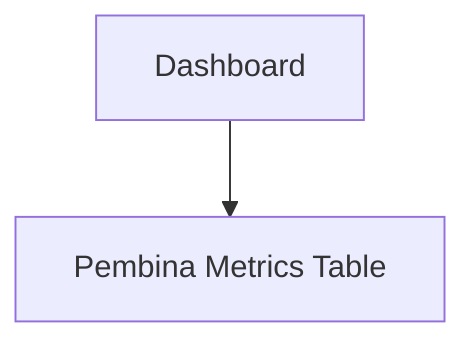

# ADMIN Phase 2 — Application User Flow (SDD)

## Document Metadata
- **Project**: SIXKUL — Sistem Informasi Ekstrakurikuler
- **Role**: ADMIN
- **Phase**: Phase 2 — Monitoring & Evaluation
- **Methodology**: Specification-Driven Development (SDD)
- **Status**: Authoritative Flow Document for Phase 2

---

## 1. Flow Philosophy (Non‑Negotiable)

ADMIN Phase 2 flows are designed for **real, production‑grade usability** by actual school administrators.

Principles:
- Zero dead clicks
- Zero placeholder UI
- Every screen answers a real ADMIN question
- Every metric is actionable as *information*, not as *control*

ADMIN Phase 2 is **observational, not operational**.

---

## 2. Entry Flow — ADMIN Phase 2 Access

### Flow: ADMIN Login → Dashboard

```mermaid
flowchart TD
  A[ADMIN Login] --> B[/admin/dashboard]
  B --> C[Phase 2 Overview Widgets]
```

**Entry Conditions**:
- User role = ADMIN
- Authentication via Clerk successful

**Failure States**:
- Unauthorized → redirect to `/unauthorized`
- Session expired → redirect to `/sign-in`

---

## 3. Flow 1 — System Overview Monitoring

### User Intent
> “Apakah sistem ekstrakurikuler berjalan dengan baik secara keseluruhan?”

### Route
```
/admin/dashboard
```

### Flow Steps
1. ADMIN lands on `/admin/dashboard`
2. System fetches aggregated metrics:
   - Total extracurriculars (ACTIVE / INACTIVE)
   - Total pembina
   - Total siswa
   - Total ACTIVE enrollments
3. Dashboard renders overview cards

### Edge Cases
- No extracurriculars → Show empty state with explanation
- API error → Inline error state, no redirect

---

## 4. Flow 2 — Extracurricular Health Monitoring

### User Intent
> “Ekstrakurikuler mana yang aktif, berisiko, atau tidak berjalan?”

### Routes
```
/admin/ekstrakurikuler
/admin/ekstrakurikuler/[id]
```

### Flow Diagram
```mermaid
flowchart TD
  A[/admin/ekstrakurikuler] --> B[Health List View]
  B -->|Select Extracurricular| C[/admin/ekstrakurikuler/:id]
```

### List View Behavior
- Each row displays:
  - Extracurricular name
  - Assigned pembina
  - ACTIVE member count
  - Last session date
  - Derived health status (Healthy / At Risk / Inactive)

### Detail View Behavior
- Read‑only detail summary:
  - Session history summary
  - Attendance rate aggregate
  - Enrollment counts

### Edge Cases
- No sessions ever → Status = Inactive
- No pembina → Flag visibly

---

## 5. Flow 3 — Participation & Engagement Metrics

### User Intent
> “Bagaimana tingkat partisipasi siswa?”

### Route
```
/admin/dashboard (Metrics Section)
```

### Flow Steps
1. ADMIN scrolls to Participation Metrics
2. System renders:
   - Attendance rate per extracurricular
   - Average attendance per session
3. Metrics are computed from **locked attendance only**

### Error Handling
- If data assumptions fail → Show blocking warning banner

---

## 6. Flow 4 — Pembina Activity Oversight

### User Intent
> “Apakah pembina menjalankan perannya dengan baik?”

### Route
```
/admin/dashboard (Pembina Oversight Section)
```

### Flow Diagram


### Behavior
- Table displays:
  - Pembina name
  - Number of extracurriculars handled
  - Sessions conducted
  - Last session date

### Flags
- No recent sessions → Highlight row
- Overloaded pembina → Informational badge

---

## 7. Flow 5 — Inactivity & Anomaly Detection

### User Intent
> “Apakah ada aktivitas yang mencurigakan atau tidak berjalan?”

### Route
```
/admin/dashboard (Alerts & Signals Section)
```

### Flow Steps
1. ADMIN views alerts section
2. System surfaces:
   - Extracurriculars with no sessions in N weeks
   - ACTIVE enrollments with zero attendance
   - Pembina assigned but inactive

### Behavior
- Alerts are **informational only**
- No action buttons

---

## 8. Global Error & Empty State Rules

- Empty data → Explain *why*, not just “No data”
- API failure → Inline error, no navigation disruption
- Partial data → Render what is safe, flag what is missing

---

## 9. Navigation Contract Enforcement

All navigation paths in Phase 2 MUST comply with the **Global Navigation Contract**:
- No `/student/*` routes
- No `/pembina/*` routes
- No standalone session or attendance routes

---

## 10. Completion Criteria (Flow)

Phase 2 flows are considered complete when:
- ADMIN can assess system health without training
- No click leads to a dead end
- All metrics are visible, stable, and explainable
- No Phase 1 or Phase 3 behavior is exposed

---

## 11. SDD Halt Clause

If during implementation:
- A flow requires mutation
- A route violates the navigation contract
- Data cannot be explained

Execution MUST stop and request clarification.

This flow document is binding for ADMIN Phase 2.

