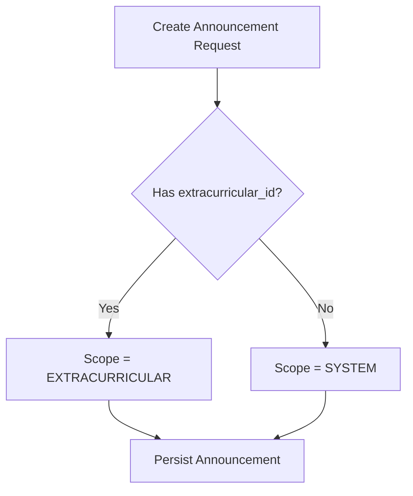
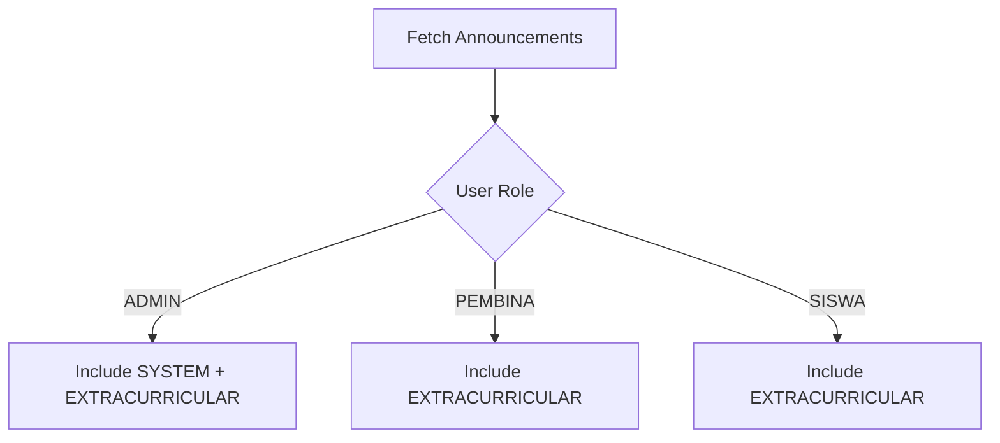
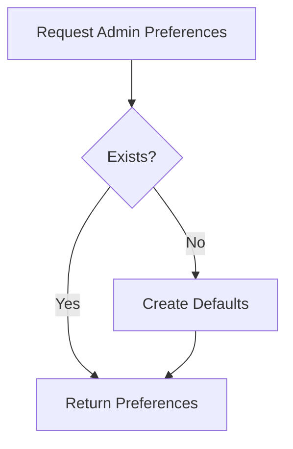
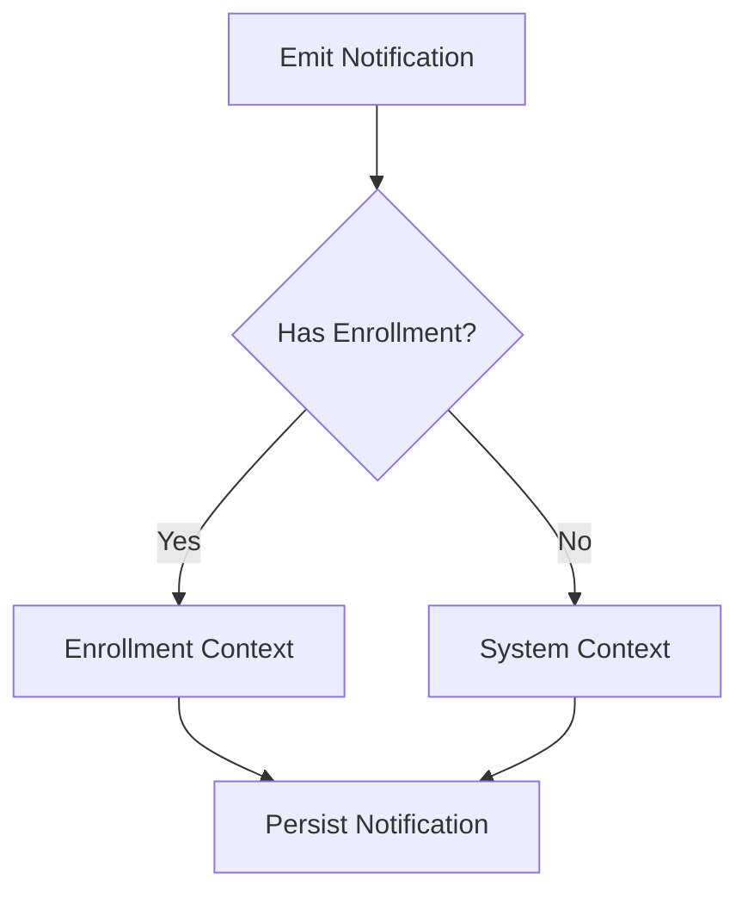
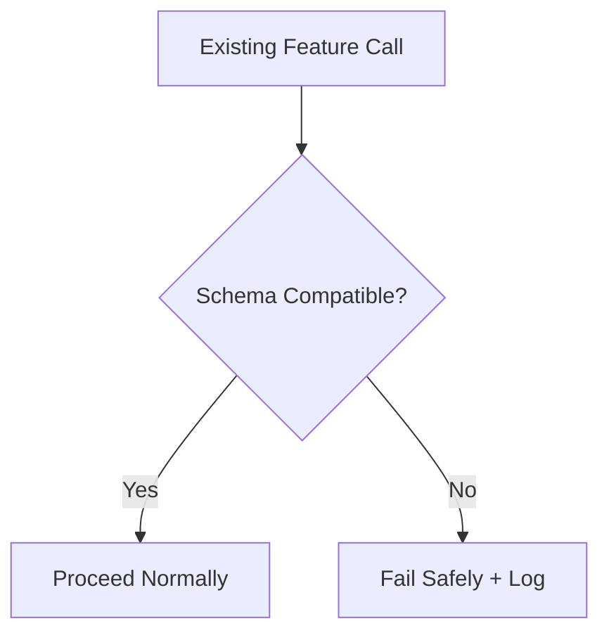

# ADMIN Phase 4.1 — Flow SDD (Infrastructure-Only)

## Document Authority
This Flow SDD is **binding** for ADMIN Phase 4.1.
It defines **conceptual and system flows only**, not UI flows.

🚫 No UI pages
🚫 No routes
🚫 No user navigation

Phase 4.1 exists to prepare the system for ADMIN Phase 4 UI.

---

## 1. Flow Design Principles

ADMIN Phase 4.1 flows are **invisible to end users**.
They define how data and system behavior MUST operate internally
once ADMIN Phase 4 UI is introduced.

**Non-negotiable principles:**
- Zero user interaction
- Backward-compatible
- Deterministic behavior
- Explicit data semantics

---

## 2. Announcement Scope Resolution Flow

### Purpose
Resolve announcement scope safely and explicitly.

### Flow Description

### Rules
- extracurricular_id is optional
- Scope is derived programmatically
- No fake foreign keys allowed

---

## 3. Announcement Retrieval Flow

### Purpose
Ensure correct announcement visibility.

### Constraints
- SYSTEM announcements are ADMIN-only
- Existing behavior for PEMBINA/SISWA must not change

---

## 4. Admin Preferences Resolution Flow

### Purpose
Ensure ADMIN preferences are always available.

### Rules
- Lazy creation only
- Defaults defined centrally
- No UI logic involved

---

## 5. Notification Context Resolution Flow

### Purpose
Decouple notifications from Enrollment-only context.

### Rules
- Existing Enrollment notifications unchanged
- System notifications reserved for ADMIN context

---

## 6. Backward Compatibility Flow

### Purpose
Ensure no regression occurs.

### Rules
- No silent failures
- No destructive migrations

---

## 7. Failure Handling & Halt Conditions

### Mandatory Halt Conditions
STOP execution if:
- Announcement scope cannot be derived
- Admin preferences cannot be created lazily
- Notification context becomes ambiguous
- Any existing feature breaks

Do NOT guess. Ask for clarification.

---

## 8. Completion Criteria (Flow-Level)

Phase 4.1 flows are COMPLETE when:
- System announcements resolve correctly
- Admin preferences always resolve
- Notification context supports ADMIN
- No UI or routing changes exist

---

## END OF FLOW SDD

