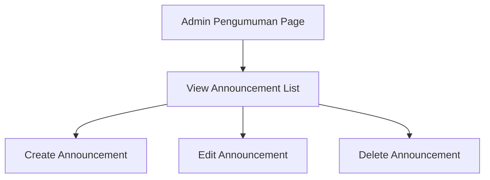
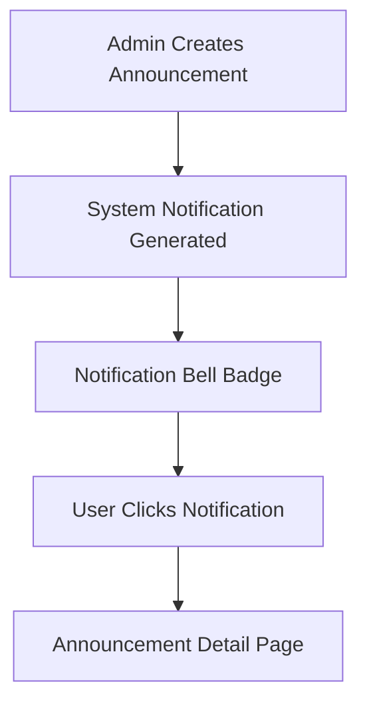
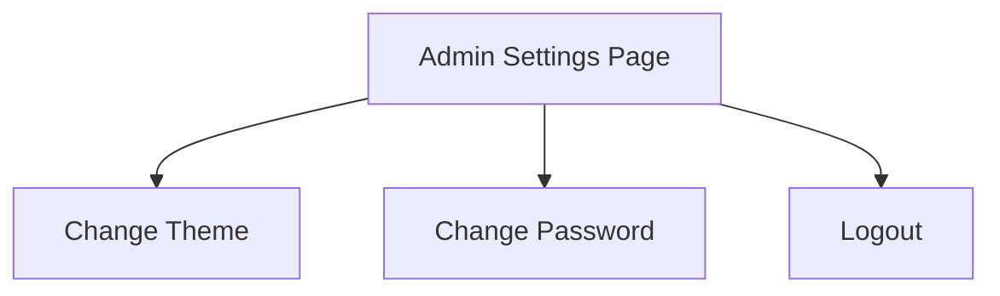

# ADMIN Phase 4.2 — Flow SDD (End-User UI & UX)

## Document Authority

This Flow SDD is **authoritative and binding** for **ADMIN Phase 4.2**.

Phase 4.2 introduces **end-user UI & UX flows** for:
- System-wide Announcements (Pengumuman Sekolah)
- Admin Profile (Profil Saya)
- Admin Settings (Pengaturan)

All flows MUST be **fully end-to-end usable** by real human users via the browser.

---

## 1. Flow Design Principles (Non-Negotiable)

1. No dead links, no 404 pages
2. No placeholder UI or disabled buttons
3. All mutations provide confirmation feedback
4. Read-only vs editable boundaries are explicit
5. All roles see exactly what they are permitted to see

---

## 2. System-Wide Announcements — ADMIN Flow

### User Intent
> “Saya ingin membuat dan mengelola pengumuman sekolah.”

### Entry Point
- Admin Sidebar → **Pengumuman**

### Route
```
/admin/announcements
```

### Flow Diagram


### Flow Steps
1. ADMIN opens Pengumuman page
2. System lists SYSTEM announcements
3. ADMIN may:
   - Click “Tambah Pengumuman” → Create
   - Click “Edit” → Edit
   - Click “Hapus” → Delete (with confirmation)
4. Changes persist immediately

### UX Rules
- Confirmation modal before delete
- Success toast after create/edit/delete
- Empty state when no announcements exist

---

## 3. System-Wide Announcements — PEMBINA & SISWA Flow

### User Intent
> “Saya ingin membaca pengumuman sekolah.”

### Entry Points
- Dashboard announcement section
- Notification click-through

### Routes
```
/pembina/announcements
/student/announcements
```

### Flow Steps
1. User opens announcements page
2. System lists SYSTEM announcements (read-only)
3. User clicks an announcement to read details

### Constraints
- No create/edit/delete controls
- Clear label: “Pengumuman Sekolah”

---

## 4. Notification Flow (All Roles)

### User Intent
> “Saya ingin tahu jika ada pengumuman baru.”

### Flow Diagram


### Rules
- Notifications are generated for all roles
- Notification routes to announcement detail

---

## 5. Admin Profile (Profil Saya) Flow

### User Intent
> “Saya ingin melihat dan mengelola informasi akun saya.”

### Entry Point
- Admin Avatar Menu → **Profil Saya**

### Route
```
/admin/profile
```

### Flow Steps
1. ADMIN opens Profil Saya
2. System displays:
   - Name (read-only)
   - Email (read-only)
   - Role: ADMIN
3. Editable fields (if any) are clearly marked

### Constraints
- No role editing
- No identity mutation beyond allowed fields

---

## 6. Admin Settings (Pengaturan) Flow

### User Intent
> “Saya ingin mengatur preferensi akun dan keamanan.”

### Entry Point
- Admin Avatar Menu → **Pengaturan**

### Route
```
/admin/settings
```

### Flow Diagram


### Flow Steps
1. ADMIN opens Pengaturan
2. ADMIN may:
   - Change theme preference (persisted)
   - Trigger password reset (Clerk flow)
   - Logout securely

### UX Rules
- Theme changes apply immediately
- Password reset opens Clerk-managed flow
- Logout invalidates session

---

## 7. Error & Empty State Handling

- No announcements → informative empty state
- Failed save → inline error message
- Unauthorized access → redirect to `/unauthorized`

---

## 8. Completion Criteria (Flow-Level)

Phase 4.2 flows are COMPLETE when:

- ADMIN can manage announcements end-to-end
- PEMBINA & SISWA can read system announcements
- Notifications route correctly
- Admin profile & settings are fully usable
- No navigation leads to 404 pages

---

## END OF FLOW SDD

