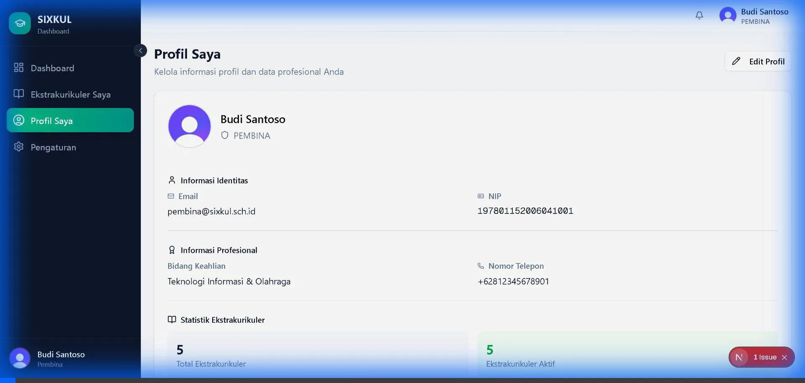
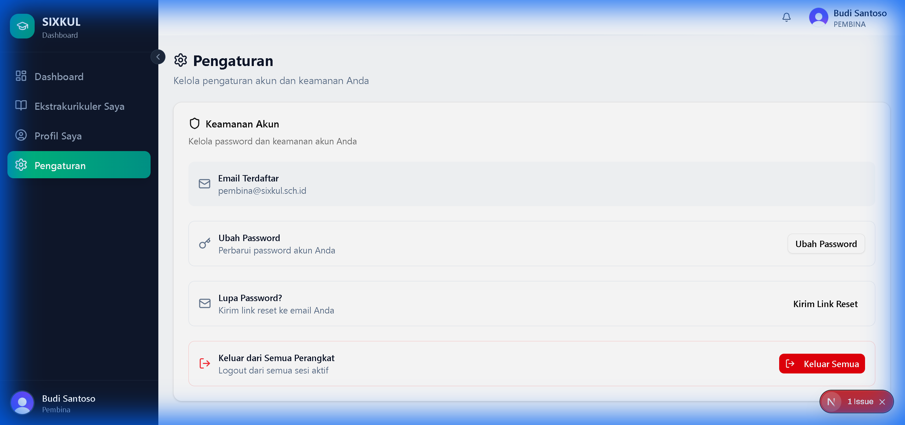
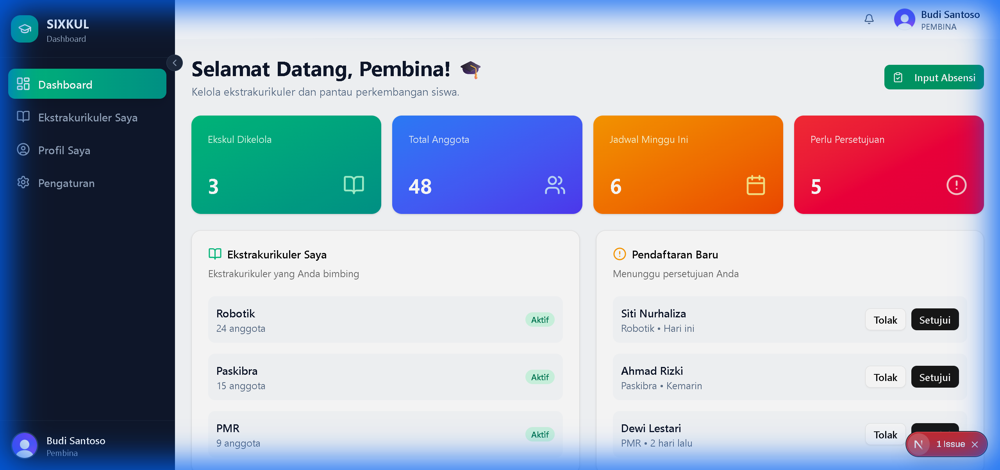

# PEMBINA Phase 9 — Implementation Walkthrough

**Completed:** 2025-12-16  
**Status:** ✅ All Tests Passed

---

## Summary

Implemented PEMBINA Phase 9 — Post-MVP Completion:

- Bell-based notification system (dropdown, no standalone route)
- Profile page with view/edit functionality
- Account settings with Clerk password management
- Navigation updates with new sidebar items

---

## Browser Test Results

All automated browser tests passed successfully.

### Test 1: Profile Page ✅

- **Route:** `/pembina/profile`
- **Result:** All elements visible
- **Verified:** Title, email, NIP (read-only), expertise, phone, statistics, edit button

---

### Test 2: Settings Page ✅

- **Route:** `/pembina/settings`
- **Result:** Security section visible
- **Verified:** Keamanan Akun, email display, Ubah Password, Kirim Link Reset, Keluar Semua

---

### Test 3: Notification Dropdown ✅

- **Location:** Bell icon in TopNavbar
- **Result:** Dropdown displays notifications
- **Verified:** Notifikasi title, Tandai semua dibaca button, notification items with timestamps

---

## Files Created

| File                                                                       | Purpose                 |
| -------------------------------------------------------------------------- | ----------------------- |
| `src/lib/pembina-notification-data.ts`                                     | Notification data layer |
| `src/lib/pembina-profile-data.ts`                                          | Profile data layer      |
| `src/components/pembina/NotificationDropdown.tsx`                          | Bell dropdown           |
| `src/app/(dashboard)/pembina/PembinaLayoutClient.tsx`                      | Client layout           |
| `src/app/(dashboard)/pembina/profile/page.tsx`                             | Profile page            |
| `src/app/(dashboard)/pembina/profile/_components/ProfileClientWrapper.tsx` | Profile UI              |
| `src/app/(dashboard)/pembina/settings/page.tsx`                            | Settings page           |
| `src/app/(dashboard)/pembina/settings/_components/SecuritySection.tsx`     | Clerk integration       |

---

## Files Modified

| File                                     | Changes                          |
| ---------------------------------------- | -------------------------------- |
| `src/app/(dashboard)/pembina/layout.tsx` | Server/Client hybrid             |
| `src/components/layout/TopNavbar.tsx`    | PEMBINA dropdown + settings link |

---

## Key Decisions Implemented

| Decision                    | Implementation                                |
| --------------------------- | --------------------------------------------- |
| NIP is READ-ONLY            | Not editable in profile form                  |
| Option A routing            | `Notification → Enrollment → Extracurricular` |
| No `/pembina/notifications` | Bell dropdown only                            |
| No Prisma password          | All auth via Clerk                            |
